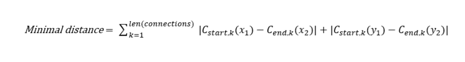
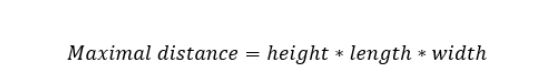
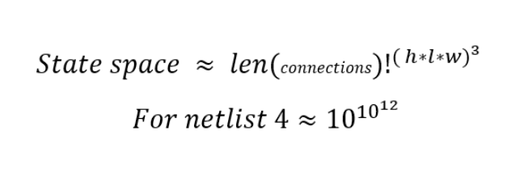

# Chips & Circuits


## De opdracht (the assignment)
#### zoals beschreven op: http://heuristieken.nl/wiki/index.php?title=Chips_%26_Circuits
Print #1 and Print #2 are arrangements of gates on a base, and all it takes is to wire the appropriate gates together. There are three net lists (in txt-format) for each print. Each net list needs to be implemented. Nets can only follow the grid, only one wire per segment, and one step costs 1 unit length. Nets that are aligned among the same grid line are said to be in collision. If there is one collision in one arrangement, the circuit cannot be used. Nets can also go up and down to lower and higher layers, also at the cost of 1 per level. The assignment is to implement all nets in all netlists at minimum cost.

### Formules
Deze formules laten zien wat het aantal mogelijke configuraties van het verbinden van de netlist zijn en wat het geschatte minima en maxima is van een score.

De score wordt door ons bepaald door de lengte van het aantal wires.
#### Lower bound

#### Upper bound

#### state space



## Aan de slag (Getting Started)

<!-- ### Chipsolver
*  ```"pip install -r requirements2.txt"```
* Open the folder chipSolver
* Edit options file to desired settings and set "new"(use new generations) and "plot"(plot the wire config) in the main script
* Run main.py as followed: "python main.py [netlist number (int)] [options nummer (int)] [Repetions of entire experiment (int)] [Name method (str)]"
EXAMPLE: ```"python main.py 1 22 5 hill"```
* Wait until done...
* In the generated figs folder there are now images of your progress
* If there were more than 1 repetion, the best is plotted and the average progress is documentated -->


### Vereisten (Prerequisites)

Deze codebase is volledig geschreven in [Python3.6.3](https://www.python.org/downloads/). In requirements.txt staan alle benodigde packages om de code succesvol te draaien. Deze zijn gemakkelijk te installeren via pip dmv. de volgende instructie:

```
pip install -r requirements.txt
```

### Structuur (Structure)

In de map Heuristieken_MM staat een werkende versie van A-algoritme samengevoegd met andere heuristieken en iteratieve algoritmes,deze staan beschreven in de readme van deze map.

In de map Chipsolver pakt het script zowel length als connecties in een algoritme aan. Hill climber, Simulated annealing, variant op local search en Plant propagation.


## Auteurs (Authors)

* Floris Fok
* Max Frings
* Mels van Eck

## Dankwoord (Acknowledgments)

* StackOverflow
* minor programmeren van de UvA
